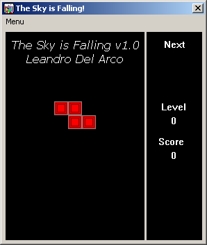

# The Sky is Falling! (Tetris Clone)

Tetris clone game developed in Visual Basic 6 using DirectX 7 (2002).

## Controls

* Pause: `P` key
* Move blocks: left and right arrow keys (`<-` and `->`)
* Drop piece faster: down arrow key (`\/`)
* Rotate piece: up arrow key (`/\`)

## Problems

> Can't initialize DirectX.

Solution: run the batch file `register_dx7.bat` as administrator.

## Objectives

If you never played tetris before (are you from this planet?), the objective is to create horizontal lines using the falling blocks, so it's cleared from the screen. 

The game is over when the blocks pille up and reach the top of the screen.

## Screenshot

